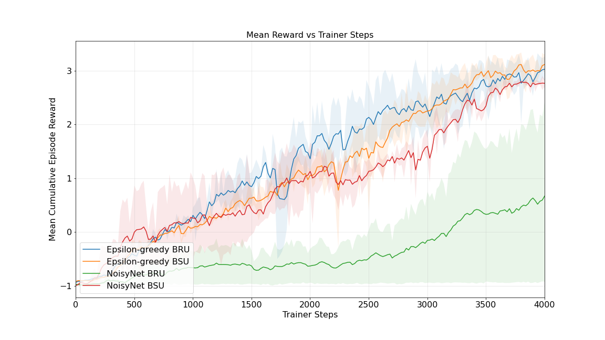
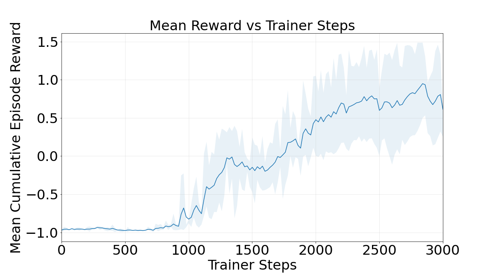

# Cooperative Multi-Agent Reinforcement Learning in Sparse-Reward, Partially Observable 3D Environments with Curriculum-Transfer Learning
The work represented here was done for my MEng thesis. It consists of an environment based very loosely on the Portal 2 game. The environment was built in Unity, and the Unity MLAgents package was used to communicate between the environment and the Python trainer. None of the MLAgents trainers or alogirhtms were used, only the grpc protocols for communication.

## Table of Contents

- [Introduction](#introduction)
- [Features](#features)
- [Requirements](#requirements)
- [Installation](#installation)
- [Usage](#usage)
- [Environments](#environments)
- [Experiments and Results](#experiments-and-results)
- [Final Important Note](#final-note)
- [References](#references)

## Introduction
This project implements the QMIX Multi Agent Reinforcement Learning algorithm in a 3D virtual environment. The algorithm is augmented with a number of features to improve its performance in the 3D environment.

## Features
The main features we implemented are as follows. These features aren't particularly groundbreaking, but they have not really been combined to see how well they work together in a multi-agent RL context.
- QMIX
- Distributed RL using Ray, splitting the RL loop into multiple executors and a learner process
- Recurrent burn-in
- Stored recurrent hidden state
- n-step returns
- Prioritised experience replay
- Reward standardisation
- Noisy neural networks for exploration
- Curiosity
- Curriculum/transfer learning to a) train agents in progressively more difficult problems and b) to transfer trained agents to tasks with related goals but slightly tweaked mechanics.

## Requirements
- Python 3.9.12

## Installation

1. Clone the repo

    ```bash
    git clone https://github.com/dewet99/3d-virtual-environment-qmix.git
    ```

2. Make a Python virtual environment. If you don't know how, you probably should figure that out first.

3. Install everything in requirements.txt
    ```bash
    pip install -r requirements.txt
    ```

4. That should be it.

## Usage
You can run an experiment by opening a terminal window in the Python folder and typing the following command:
```bash
python main.py --run_type --config
```
Where `--run_type` can be either `train` or `test` and `--config` can be any of the config files that starts with the prefix `experiment` in the config folder. 

### Training
Running an experiment with `train` will generate the `results` directory, where the models and tensorboard logs are saved. Models are saved every 500 training updates, and the tensorboard logs are saved every 20 training updates, by default.

### Testing
Testing is not automatic. If you want to generate test results, you will have to run the command with the `test` argument, and specify in the config file which models you want to load, as well as how many episodes should be run. The results from testing are saved in the `eval_results` directory as `.npy` files, which can be used to visualise test results if you write the relevant code. I did not include code for visualising test results in this repo.

## Environments
We include the following environments and perform various experiments in them. Note that there is no environment for experiment_2, as experiment_1 and experiment_2 use the same environment with different configs.
- experiment_1_ablation
- experiment_3_sparse_rewards
- experiment_4_full_action_space_pre_train
- experiment_4_full_action_space
- experiment_5_cooperative

For each of the above environments, there is also a corresponding test environment. These environments end with "_test". Functionally, they are exactly the same, except that the test environments allow you to see the environment, both from a top-down perspective and from each agent's perspective. You can open a test environment by navigating to its respective .x86_64 file and double-clicking it. Linux only.

### Environment Controls
The test environments can be controlled with heuristics. It's a bit janky, but it's not really meant for human players to solve. The controls are as follows:

#### Camera Controls:
Use the C button on your keyboard to change camera perspective. It has 6 different options, starting at 0 (on launching the environment) to 5.
- 0: On opening the environment. No actions are possible.
- 1: You are able to control the green agent, but you cannot see it's perspective. You have to press "C" again to see its perspective. See what I did there?
- 2: Starting agent perspective becomes active.
- 3: Top-down view, control green agent.
- 4: Top-down view, control blue agent.
- 5: Top-down view, no control.

Keep pressing C until you control the agent you want to control, in the way that you want to control it.

#### Agent Controls
You control an agent as follows:
- W, A, S, D: forward, left, back, right, respectively.
- left arrow, right arrow: look left and right, respectively
- left-click: place portal A, in the environments which has this functionality enabled (experiments 4 and 5)
- right-click: place portal B, in the environments which has this functionality enabled (experiments 4 and 5)

## Experiments and Results
We performed five experiments to verify the algorithm's performance. We started out with an ablation study to verify the contribution of each of the implemented components mentioned in [features](#features) towards the algorithm's performance. We also include a video of the agents fully trained in each experiment.

**Important Note: I do not present my findings and conclusions here, only the results.**

### Experiment 1: Ablation Study Results
**Environment used: experiment_1_ablation**

The training curves for the ablation study is shown below. Initially, noisynet did not work at all and was thus not included in the ablation study. However, we managed to fix it and we performed a separate experiment with it.

Link: [https://youtu.be/Hv8gBbJ-S9U](https://youtu.be/Hv8gBbJ-S9U)

### Experiment 2: Exploration Strategies
**Environment used: experiment_1_ablation**
We used the same environment as in the previous experiment, with all features enabled. We compared the performance of NoisyNet to Epsilon Greedy. We have four different experiments.
- SRU: Sequential Random Updates
- BRU: Bootstrapped Random Updates
Read the DRQN paper to understand the difference.



In the future, I'd like to see whether NoisyNet can outperform e-greedy on the next experiment, where transfer learning was necessary for the agents to solve the problem.

### Experiment 3: Sparse Rewards
**Environment used: experiment_3_sparse_rewards**

We tried four different approaches to solving a sparse reward problem:
- The best performing algorithm from experiment 1.
- The above, with a curiosity module
- Transferring the trained models from experiment 1 to this environment.
- Transferring the trained models from experiment 1 to this environment, coupled with a curiosity module.

The results are as follows:

Link: [https://youtu.be/q_C1DRuNCJU](https://youtu.be/q_C1DRuNCJU)

### Experiment 4: Curriculum Learning with the Full Action Space
Experiments 1 through three had a reduced action space, where the agents couldn't place portals. In this experiment, they can place portals and need to use them to solve the problem. We use curriculum learning, and therefore two environments. We first train them in the environment but reduce the goal to "one agent needs to place two portals", call this **Curriculum A**. Then, we train them in the full problem, where they both need to place two portals and navigate to a target zone, called **Curriculum B**.

#### Curriculum A
**Environment used: experiment_4_full_action_space_pre_train**
We train them for a short while, until the agents learn to somewhat placed portals. Then, we take those trained models and place them into the next environment.

Link: [https://youtu.be/gn-xrrF2kBI](https://youtu.be/gn-xrrF2kBI)

#### Curriculum B
**Environment used: experiment_4_full_action_space**
Again, we compare the base algorithm with the algorithm that uses curriculum learning, or transfer learning.

Link: [https://youtu.be/iXVBdkBzs_M](https://youtu.be/iXVBdkBzs_M)

### Experiment 5: Cooperation and Transfer Learning
Finally, we change the environment dynamics, so that the problem goal is the same, but the mechanics of achieving the goal is different. We then transfer the agents from Experiment 4 and see whether they can solve the problem. We again compare it with the base algorithm.


Link: [https://youtu.be/3uNIQMH3l8s](https://youtu.be/3uNIQMH3l8s)

## Final Note:
Explanations of hyperparameters, reward functions and pretty much everything you could ask are available in my thesis, which I might include in this repo at a later date.

## References
The references for the main papers I used are below. I also used code from various repositories, and can't remember them all. If you find anything that should be references, let me know and I'll happily add it below.

- DRQN: [https://arxiv.org/abs/1507.06527](https://arxiv.org/abs/1507.06527)
- R2D2: [https://openreview.net/pdf?id=r1lyTjAqYX](https://openreview.net/pdf?id=r1lyTjAqYX)
- QMIX: [https://arxiv.org/abs/1803.11485](https://arxiv.org/abs/1803.11485)
- RAINBOW: [https://arxiv.org/abs/1710.02298](https://arxiv.org/abs/1710.02298)
- Curiosity: [https://arxiv.org/abs/1705.05363](https://arxiv.org/abs/1705.05363)
- NoisyNet: [https://arxiv.org/abs/1706.10295](https://arxiv.org/abs/1706.10295)
- Prioritised experience replay: [https://arxiv.org/abs/1511.05952](https://arxiv.org/abs/1511.05952)

